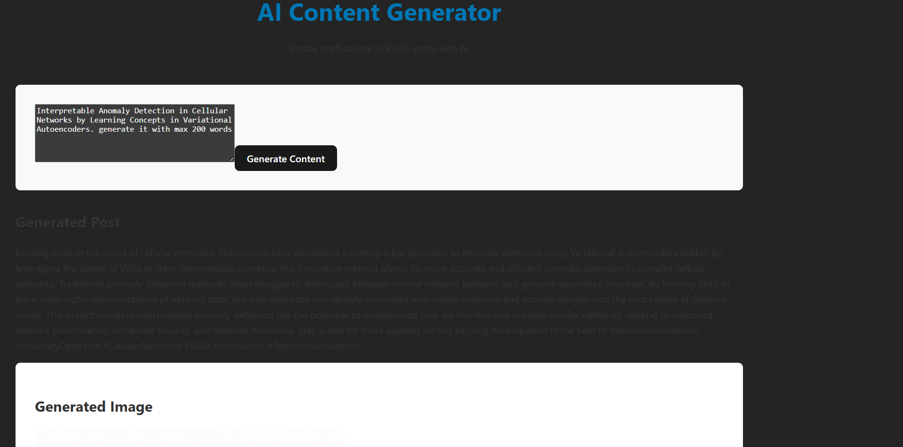

# AI Content Generator

A web application that generates LinkedIn posts and matching images using OpenAI's GPT and DALL·E APIs.

## Features

- Generate LinkedIn-style text content based on a user prompt
- Generate an AI-created image matching the theme
- Simple and intuitive web interface
- Frontend and backend architecture connected via API

## Technologies

- Frontend: React + Vite
- Backend: Node.js / Express
- APIs: OpenAI (GPT & DALL·E)
- Other: dotenv, Axios, CORS

## Setup Instructions

### Backend Setup

1. Open your terminal and navigate to the `backend` folder:
